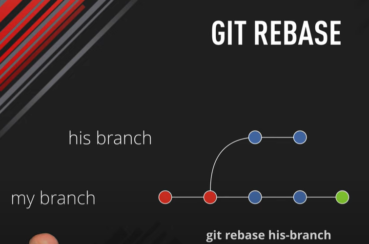

# BRANCH

## Git Master Branch

The master branch is a default branch in Git. It is instantiated when first commit made on the project. When you make the first commit, you're given a master branch to the starting commit point. When you start making a commit, then master branch pointer automatically moves forward. A repository can have only one master branch.

Master branch is the branch in which all the changes eventually get merged back. It can be called as an official working version of your project.

### Create Branch

You can create a new branch with the help of the **git branch** command

```git
git branch <new_branch>
```

### List Branch

You can List all of the available branches in your repository by using the following command.

```git
git branch --list  
git branch
```

### Delete Branch

```git
git branch -d <branch name>  
```

### Delete a Remote Branch

```git
git push origin -delete <branch name>  
```

### Switch Branch

```git
git checkout<branch name>  
```

### Rename Branch]

```git
git branch -m <old branch name> <new branch name>  
```

### Merge Branch

Git allows you to merge the other branch with the currently active branch. You can merge two branches with the help of **git merge** command.

```git
 git merge <branch name>  
```

# Git Merge and Merge Conflict

In Git, the merging is a procedure to connect the forked history. It joins two or more development history together. The git merge command facilitates you to take the data created by git branch and integrate them into a single branch. Git merge will associate a series of commits into one unified history. Generally, git merge is used to combine two branches.

**merge the specified commit to currently active branch**

```git
 git merge <commit>  (commit number)
```

**merge commits into the master branch**

```git
 git merge <branchname>  
```

## GIT REBASE

Rebasing is a process to reapply commits on top of another base trip. It is used to apply a sequence of commits from distinct branches into a final commit. It is an alternative of git merge command. It is a linear process of merging.

**NB :** Use rebase **whenever you want to add changes of a base branch back to a branched out branch**. Typically, you do this in feature branches whenever there's a change in the main branch

```git
git rebase <branch name>
```



- **Replays** your commits on top of the news base

- **Rewrites** history by creating  new commits 

- **Keeps** git history clean

- **Rebase** your own local branches

- **Don't** rebase public branches - master

- **Undo** rebase with git reflog

## GIT SQUASH

To "squash" in Git means **to combine multiple commits into one**. You can do this at any point in time (by using Git's "Interactive Rebase" feature), though it is most often done when merging branches.

- check commit history : **git log --oneline**

- Choose the commits to squash : **git rebase -i HEAD ~3**

-  **update the commits**
